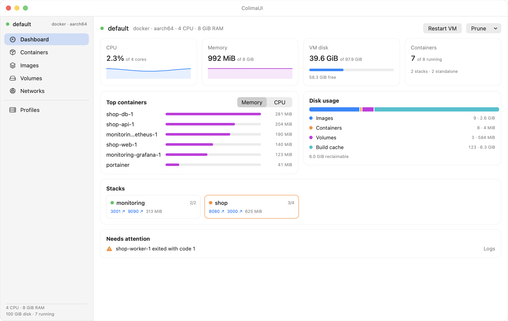
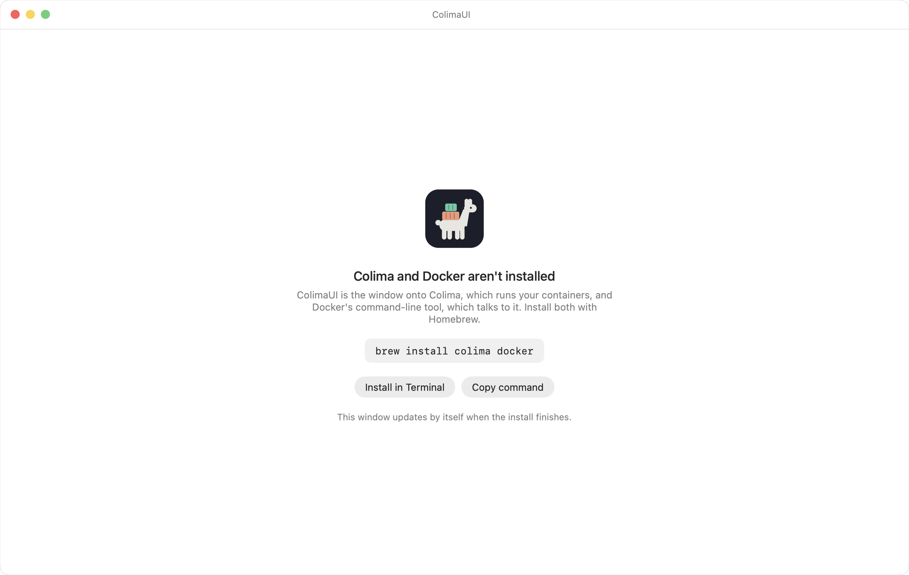
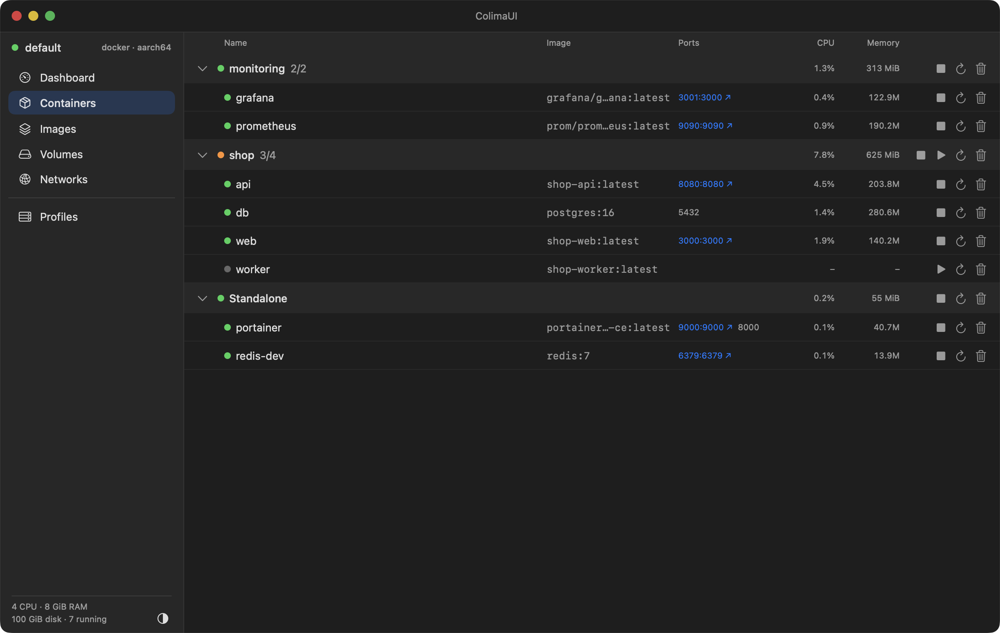
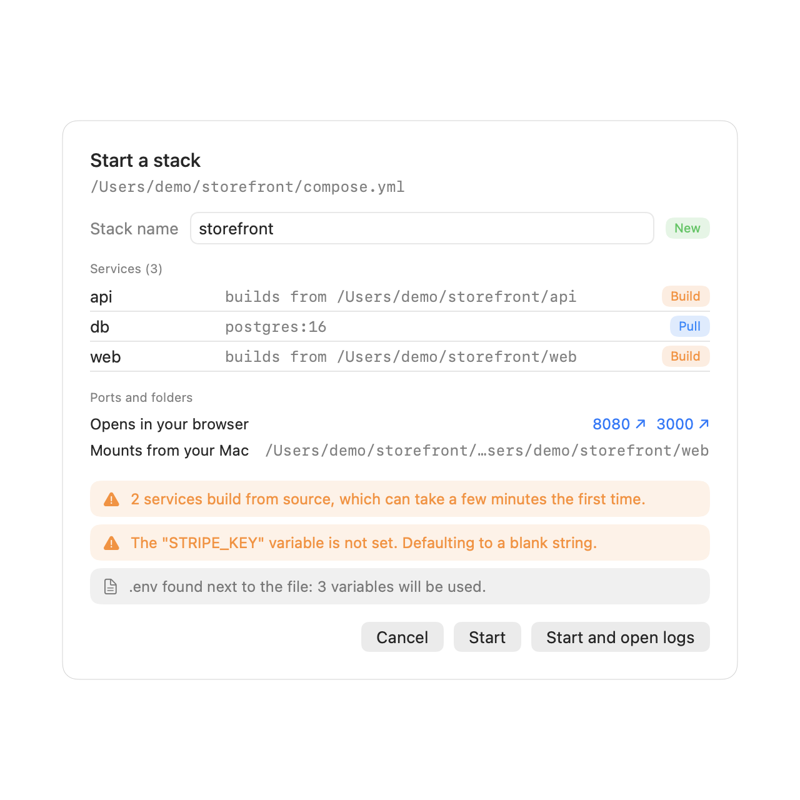
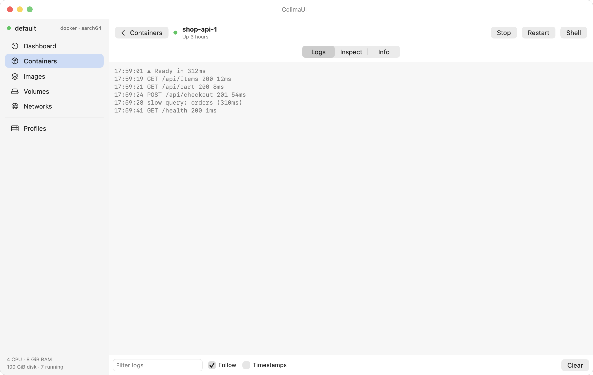
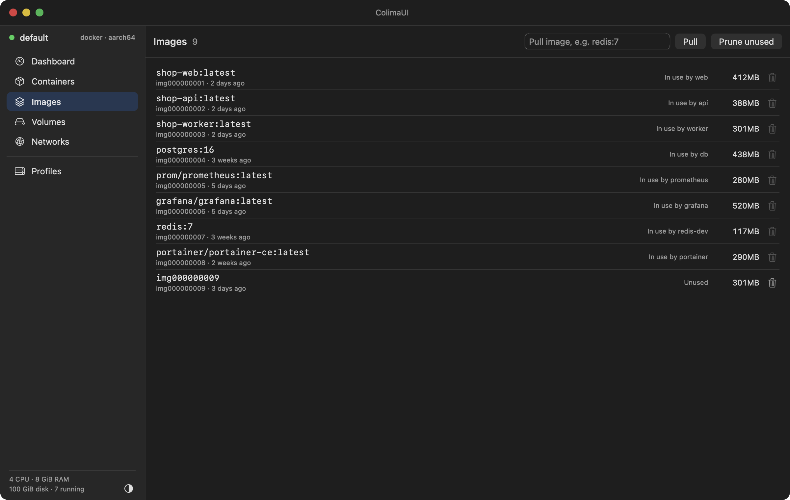
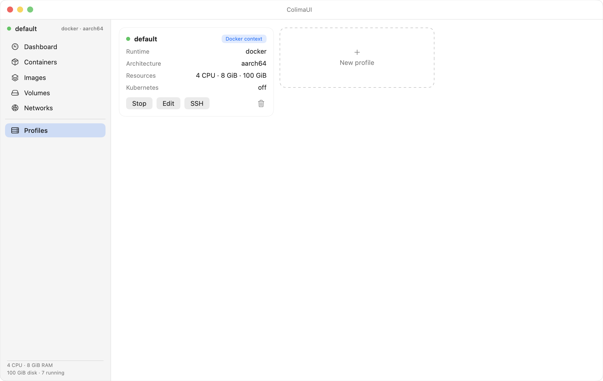
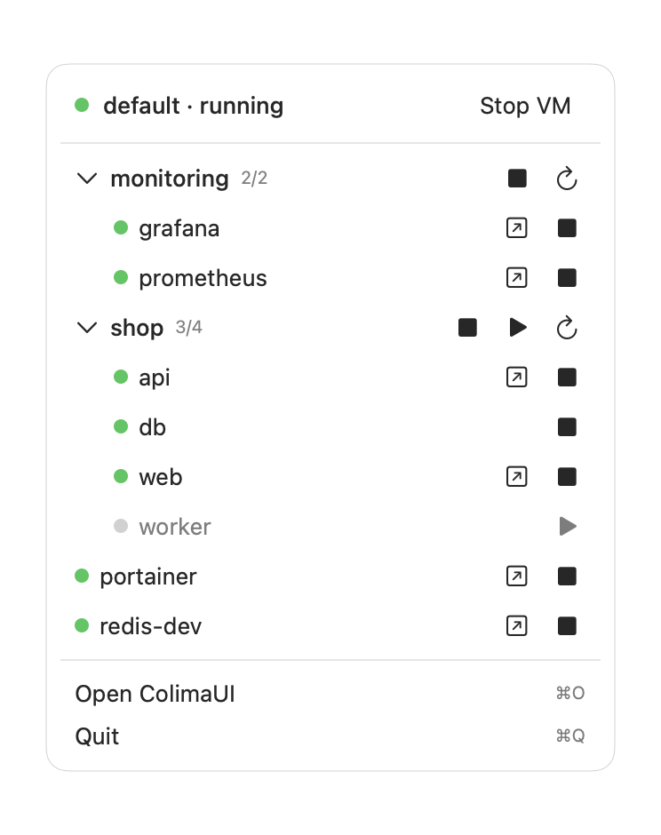

<p align="center">
  
</p>

<h1 align="center">ColimaUI</h1>

<p align="center">
  A native macOS app for <a href="https://github.com/abiosoft/colima">Colima</a>.<br>
  See your stacks, containers, logs and disk use at a glance.
</p>

<p align="center">
  <picture>
    <source media="(prefers-color-scheme: dark)" srcset="docs/screenshots/dashboard-dark.png">
    
  </picture>
</p>

## Install

```bash
brew tap pawiromitchel/colimaui https://github.com/pawiromitchel/colimaui
brew install --cask colimaui
```

That's all it takes on a fresh Mac. The cask installs `colima` and `docker` through Homebrew if you don't have them yet. To update later:

```bash
brew upgrade --cask colimaui
```

Requires macOS 14 (Sonoma) or newer, on Apple Silicon or Intel.

<details>
<summary>Install without Homebrew</summary>

Download `ColimaUI-<version>.zip` from the [latest release](https://github.com/pawiromitchel/colimaui/releases/latest), unzip it, and drag **ColimaUI.app** to Applications.

The app is signed ad hoc rather than notarized by Apple, so macOS blocks the first launch. Either right-click the app and choose **Open**, or clear the flag once:

```bash
xattr -dr com.apple.quarantine /Applications/ColimaUI.app
```

You'll also need Colima and Docker's command-line tool: `brew install colima docker`.
</details>

### If Colima or Docker isn't installed yet

You don't have to work it out. ColimaUI checks for `colima` and `docker` when it opens and, if either is missing, shows what's needed with a one-click **Install in Terminal** button. It watches for the install to finish and moves on to the dashboard by itself. No Homebrew either? It tells you and links to [brew.sh](https://brew.sh).

<p align="center">
  
</p>

Once the tools are there but no VM exists yet, the dashboard offers **Start Colima**, which creates the default profile for you. The first start downloads a small Linux image and takes a minute or two.

## What it does

### Dashboard

The page the app opens on. CPU and memory with a short sparkline, how full the VM disk is, and a running count. **Top containers** ranks by memory or CPU, the **disk usage** bar splits images, volumes and build cache and shows what a prune would free (build cache is usually the big one), and each Compose **stack** gets a card with its status and clickable ports.

**Needs attention** lists crashed or restarting containers and a nearly full disk, with a link to the logs or the fix. The same signal puts a small badge on the menu bar icon.

### Containers, grouped by stack

<p align="center">
  
</p>

- Containers are grouped by **Compose stack**, with the running count and combined CPU and memory on each stack row. Group by image or switch grouping off from the toolbar.
- Start, stop, restart or delete a single container or a whole stack. Ports are links that open in your browser.
- Search by name, image, stack or port.

### Drop a compose file to start a stack

Drag a `compose.yml` or `docker-compose.yml` (or a folder that has one) onto the window, or use **File > Start Stack from Compose File…** (⌘O) or the **+** in the Containers toolbar.

Nothing runs straight away. A review sheet shows the stack name, each service and whether it will be built or pulled, the ports that open in your browser, the folders it mounts from your Mac, and warnings such as unset variables or privileged containers. Then **Start** runs `docker compose up -d` from the file's folder (so relative paths and `.env` work), with live progress, and **Start and open logs** takes you to the stack when it's up. Drop several files, such as a base file and an override, and they're combined. Drop a stack that already exists and the button reads **Update**.

<p align="center">
  
</p>

If the file is broken, you see Docker's own error before anything starts. Compose has to be installed separately (`brew install docker-compose`); ColimaUI uses either that or the `docker compose` plugin.

### Logs and details

<p align="center">
  
</p>

Click a container to open it full-width: live logs with filter, follow and timestamps, `docker inspect`, and an info tab. **Shell** opens a session in Terminal. Click a stack instead and you get its services merged into one color-coded log.

### Images, volumes, networks and profiles

<p align="center">
  
  
</p>

- **Images** show which containers use them, and you can pull, delete and prune.
- **Volumes** show which stack they belong to and can be pruned. **Networks** can be listed and deleted.
- **Profiles** are cards: start, stop, edit CPU, memory, disk and Kubernetes, create or delete profiles, switch the Docker context, or SSH in.

### Menu bar

<p align="center">
  
</p>

Control the VM, whole stacks and single containers without opening the window. The llama in the menu bar is dimmed when the VM is stopped and gets a small dot when something needs attention.

## How it works

ColimaUI is a thin window over the tools you already have. It runs the `colima` and `docker` command-line tools and points `DOCKER_HOST` at the profile's own socket (`~/.colima/<profile>/docker.sock`), so it never changes your active Docker context unless you press **Use context**. Container lists refresh every few seconds (2 to 30, in Settings), and logs stream live.

The app isn't sandboxed, because it has to run those tools.

## Releases

Every merge to `main` publishes a new version automatically:

1. The release workflow runs the tests and builds a universal (Apple Silicon and Intel) `ColimaUI.app`.
2. It publishes a GitHub release `vX.Y.Z` with `ColimaUI-X.Y.Z.zip` and its checksum.
3. It updates the Homebrew cask in [`Casks/colimaui.rb`](Casks/colimaui.rb) to point at it.

The version bumps by **patch** by default. Put the label `minor` or `major` on the pull request to bump those instead, or `skip-release` to publish nothing for that merge. Merges that only change Markdown, `docs/` or the cask don't release.

## Build from source

You only need the Xcode Command Line Tools, not Xcode.

```bash
git clone https://github.com/pawiromitchel/colimaui.git
cd colimaui
./scripts/bundle.sh          # builds build/ColimaUI.app
open build/ColimaUI.app
```

```bash
./scripts/test.sh                       # unit tests, no Colima needed
COLIMAUI_E2E=1 ./scripts/test.sh        # also runs live tests against your running Colima
./scripts/e2e-app.sh                    # builds the app, launches it, checks it against `docker ps`
VERSION=1.2.3 ./scripts/package.sh      # universal release zip in dist/
./scripts/screenshots.sh                # regenerates the screenshots above from the demo setup
```

The live tests only create and remove containers named `colimaui-e2e-*`. They never stop your VM.

### Layout

| Path | What's in it |
|---|---|
| `Sources/ColimaKit` | Models, CLI parsing, the `colima` and `docker` clients, grouping, the observable `ColimaStore`, and the demo setup. No UI, fully tested. |
| `Sources/ColimaUI` | The SwiftUI app: window, menu bar, settings, and the icon artwork (drawn in code). |
| `scripts/` | Bundling, packaging, tests, screenshots, cask rendering. |
| `.github/workflows` | CI for pull requests, and the release workflow. |

## Troubleshooting

**"ColimaUI can't be opened because Apple cannot check it."** Installed by hand? See [Install without Homebrew](#install). The Homebrew cask clears this for you.

**Homebrew installed a `docker` formula even though I already have a `docker` command.** The cask lists `docker` as a dependency so a fresh Mac gets everything. If your existing `docker` comes from somewhere else, Homebrew leaves its own copy unlinked and yours keeps working. `brew uninstall docker` removes it if you prefer.

**The dashboard says my VM disk couldn't be read.** ColimaUI reads it with `colima ssh -- df`, which needs a running VM.

## License

[MIT](LICENSE)
